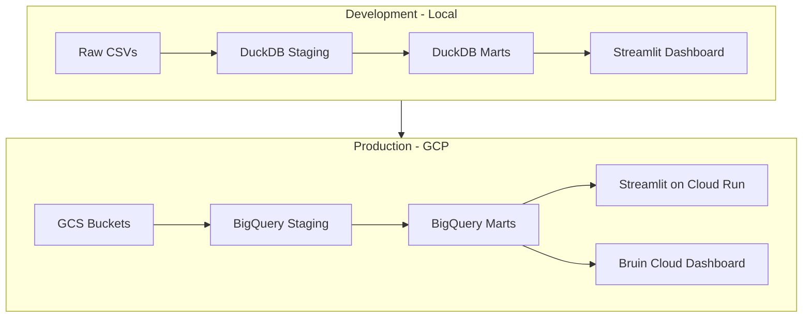

# Civil Liberties & Censorship Analysis in Kenya with Bruin
## Analyzing Government Takedown Requests & Civil Liberties Risks (2024–2026)

## 🎯 Project Pitch and Problem Statement

Across the world, governments are increasingly requesting the removal of online content — from social media posts to blogs, videos, and news articles. While some requests may be justified (e.g., protecting minors, removing illegal content), others risk undermining civil liberties, freedom of expression, and democratic resilience. Without transparent, reproducible analysis, it is difficult for researchers, journalists, and civil society to distinguish legitimate governance from censorship.

Kenya provides a timely case study. Between 2024 and 2026, the country has experienced waves of political protests, contentious legislation, and heightened online activism. During this period, Google Transparency Reports show a surge in takedown requests from Kenyan authorities, with a rejection rate of ~62% in H1 2025. At the same time, ACLED data records spikes in conflict events and fatalities, while OONI and other internet measurement projects detect anomalies in access to social platforms. These signals suggest a complex relationship between political unrest, government actions, and digital freedoms.

This project builds a reproducible, low‑cost data engineering pipeline using Bruin to:

    - Ingest Google Transparency Report takedown data (filtered to Kenya),
    
    - Enrich it with ACLED conflict/protest events and global social media censorship incidents,
    
    - Compute temporal and geospatial alignments across datasets,
    
    - Generate a composite Civil Liberties Risk Index that quantifies suppression patterns,
    
    - Produce interactive dashboards highlighting trends in Kenya (2024–2026) and offering a template for global replication.

Core question: How do government takedown requests correlate with political events, protests, and conflict spikes in Kenya — and what lessons can be drawn for other countries facing similar dynamics?

## 🔹 Development vs. Production Environments

A central design principle of this project is reproducibility across environments:

## Development (DuckDB):  

All assets, marts, and dashboards can be run locally using DuckDB. This ensures low‑cost experimentation, fast iteration, and reproducibility for students, researchers, and collaborators without requiring cloud credits.

## Production (GCP + Bruin Cloud):  

The same pipeline can be deployed to Google Cloud Platform (GCP) using Terraform.

    - GCS serves as the data lake for raw and staged assets.
    
    - BigQuery acts as the warehouse for marts and analytical queries.
    
    - Bruin Cloud Dashboard provides a hosted environment for pipeline monitoring, lineage visualization, and orchestration in production.
    
    - Cloud Run + Streamlit hosts the interactive dashboard for public access, complementing Bruin’s cloud dashboard with custom visualizations tailored to civil liberties analysis.

This dual setup mirrors industry practice: Bruin Cloud ensures scalability, durability, and collaborative state management for the pipeline, while Streamlit remains the flexible, researcher‑friendly interface for storytelling and custom analysis. Together, they provide both operational reliability and narrative clarity.
By designing the pipeline to run seamlessly in both DuckDB (dev) and GCP (prod), we guarantee that findings are reproducible, infrastructure is transparent, and collaborators can choose the environment that fits their resources.

## 🔹 Why It Matters Globally

Although Kenya is the focal case study, the methodology is globally relevant:

    - Governments worldwide are increasing reliance on takedown requests and censorship measures.
    
    - Researchers and journalists need reproducible tools to audit these actions.
    
    - Civil society organizations benefit from transparent dashboards that highlight suppression patterns.
    
    - Data engineers can showcase how modern pipelines (Bruin, DuckDB, BigQuery, Terraform) can be applied to socially impactful problems.

## Audience:

    - Researchers studying freedom of expression and digital rights
    
    - Journalists investigating censorship and government transparency
    
    - Civil society and policy analysts monitoring democratic resilience
    
    - Data engineers and students seeking reproducible, impactful pipeline projects

Built end‑to‑end with Bruin — ingestion, SQL/Python transforms, quality checks, orchestration — this project demonstrates how reproducible pipelines can illuminate one of the most pressing issues of our time: the balance between state authority and civil liberties in the digital age.

## Table of Contents
- [Tech Stack](#tech-stack)
- [Project Architecture](#project-architecture)
- [Project Structure](#project-structure)
- [Datasets](#datasets)
- [Data Pipeline](#data-pipeline)
- [Ethics and Responsible Use](#ethics-and-responsible-use)
- [Dashboard + Visualizations](#dashboard-&-visualizations)
- [Setup Instructions](#setup-instructions)
- [Milestones and Next Steps](#milestones-and-next-steps)
- [Contact Information](#contact-information)

---

# ⚙️ Tech Stack
    - Bruin → ingestion, transformations, orchestration, lineage
    
    - DuckDB (Dev) → local, low‑cost, reproducible runs
    
    - GCP (Prod) → scalable deployment
    
    - GCS (data lake)
    
    - BigQuery (warehouse)
    
    - Bruin Cloud Dashboard (pipeline monitoring, lineage, orchestration)
    
    - Cloud Run + Streamlit (public dashboard)
    
    - Terraform → infrastructure as code (GCS, BigQuery, IAM, Cloud Run)
    
    - Python 3.12 + uv → dependency management
    
    - Streamlit → interactive dashboards
    
    - GitHub Actions → CI/CD (tests, linting, infra deploy, app deploy)

# 🏗 Project Architecture

**Entity Relationship Diagram(ERD)**


---


# 📂 Project Structure
```
civil-liberties-censorship-kenya-bruin/
├── bruin/
│   ├── assets/ingest/       # ingestion YAML/SQL/Python
│   ├── assets/staging/      # cleaning & normalization
│   ├── assets/marts/        # enriched tables, risk index
│   └── pipeline.yml         # DAG definition
├── src/streamlit_app/       # app.py + visualizations.py
├── infra/                   # Terraform + GCP infra
│   ├── main.tf
│   ├── variables.tf
│   ├── terraform.tfvars
│   ├── provider.tf
│   ├── outputs.tf
│   └── modules/
│       ├── gcs/
│       ├── bigquery/
│       └── iam/
├── tests/                   # asset tests, pytest
├── docs/screenshots/        # Bruin lineage, flows, dashboards
├── .env.example
├── Makefile                 # infra-apply, run-pipeline, deploy-app
├── pyproject.toml
├── uv.lock
├── README.md
└── LICENSE
```


# 📊 Datasets

| Dataset                              | Source                                                                 | Access Method                          | Coverage Focus       | Key Fields                              |
|--------------------------------------|------------------------------------------------------------------------|----------------------------------------|----------------------|-----------------------------------------|
| Google Transparency Report           | https://transparencyreport.google.com/government-removals/data        | CSV download (semi-annual files)       | Global, filter Kenya | Date, country, requester, platform, motive, items requested, action taken |
| ACLED (Armed Conflict Location & Event Data) | https://acleddata.com/data-export-tool/ (myACLED account required) | CSV export tool or API                 | Kenya events         | Event date, location (county), event type, actors, fatalities |

| Additionally                             | OONI (internet measurements), (Optional) WHO infodemic proxies                   | Manual CSV / API                       | Kenya-specific       | Shutdown dates, misinfo events          |

**Notes**:
- Google: Download full historical CSVs → filter Kenya in staging.
- ACLED: Free registration required for export tool/API.
- All datasets ingested via Bruin (API,CSV file/URL, HTTP connectors).

---

# 🔄 Data Pipeline 

1. **Ingestion**  
   Bruin + ingestr connectors:  
   - HTTP / CSV URL for ACLED API exports  
   - File / local CSV for Google & Mendeley downloads

2. **Transformation** (SQL + Python)  
   - Staging: Clean, normalize (dates, Kenya county names, ISO codes)  
   - Enrichment: Temporal windows (e.g., ±30 days), geospatial joins, motive categorization  
   - Marts: Aggregates by motive/date/region + **Risk Index**  
     Risk Index = (normalized takedown count) × (nearby ACLED violent events score) × (social censorship weight)

3. **Orchestration**  
   Bruin pipeline.yml DAG: ingest → stage → quality checks → marts → export  
   Weekly schedule, failure alerts (configurable)

4. **Analysis & Visualization**  
   Bruin cloud + Streamlit dashboard:  
       - Kenya county heatmap (takedowns + ACLED)  
       - Timeline (spikes vs known protest periods)  
       - Actor breakdown (e.g., CAK vs platforms)  
       - Risk index map & motive pie charts

---


# Ethics and Responsible Use

- Data is public/aggregated — no personal information processed.
- Analysis is descriptive and neutral; no causal claims without evidence.
- Findings presented for transparency and research — not political advocacy.
- Users encouraged to verify sources and cite original datasets.

---

# 📊 Dashboard & Visualizations
Kenya county heatmap (takedowns + ACLED)

    - Timeline (spikes vs protests)
    
    - Actor breakdown (CAK vs platforms)
    
    - Risk index map & motive pie charts
    
    👉 Placeholder: screenshots to be added before submission.


# 🚀 Setup Instructions

## Step 1: Clone the repo:
   ```bash
   git clone https://github.com/<your-username>/civil-liberties-and-Censorship-Analysis-with-Bruin.git
   cd civil-liberties-and-Censorship-Analysis-with-Bruin
  ```

## Step 2: Environment Setup
Python 3.12 + uv for dependency management.

- Install Bruin CLI.

- Create virtual environment:

```bash
uv venv source .venv/bin/activate
uv pip install -e ".[dev,test]"
  ```
- Add pyproject.toml + uv.lock for reproducibility.

## Step 3: Ingest Assets
  - ACLED Kenya CSV (via export tool) → place in data/raw/
  - Google Transparency CSV → place in data/raw/
  - Mendeley CSV → place in data/raw/
  - Optional: OONI/WHO → manual CSV ingestion.

Each ingestion asset defined in bruin/assets/ingest/.

## Step 4: Stage Assets
Clean raw tables (dates, country filters).
Normalize schema (Kenya counties, motives).
Store in DuckDB (local .db file).
SQL files in bruin/assets/staging/.

## Step 5: Analytical Marts
events_by_type: takedowns grouped by motive.
events_by_date: temporal alignment with ACLED protests.
events_by_region: geospatial join (Kenya counties).
risk_index: composite score (takedowns × conflict × social events).
SQL in bruin/assets/marts/.

## Step 6: Orchestration
- pipeline.yml defines DAG:
  ``pipeline.yml
ingest_acled → stg_acled
ingest_takedowns → stg_takedowns
ingest_social → stg_social
stg_* → marts (events_by_type, risk_index)
  ``
- Add data quality checks (NOT NULL, UNIQUE, valid date ranges).
- Bruin CLI runs pipeline with:
  ```bash
  bruin run bruin/pipeline.yml
  ```
## Step 7: Dashboard
- Streamlit app in src/streamlit_app/.
Visualizations:
  - Heatmap (counties).
  - Timeline (spikes vs protests).
  - Actor dashboard (CAK vs platforms).
  - Risk index map.

Local run:
```bash
streamlit run src/streamlit_app/app.py
```
## Step 8: Infrastructure
Terraform scripts in /terraform for GCP resources:
  - GCS (data lake).
  - BigQuery (warehouse).
  - Cloud Run (dashboard deployment).
Makefile commands:
  - Make infra-apply → deploy infra.
  - Make app-deploy → deploy Streamlit to Cloud Run.

## Step 9: CI/CD
GitHub Actions workflow:
  - Run tests on push.
  - Lint + format with pre-commit.
  - Deploy infra + dashboard on tagged release.

## Step 11: Documentation
Update README.md with:
  - Architecture diagram.
  - Dataset sources.
  - Setup instructions.
  - Screenshots of Bruin lineage + dashboard.

## Step 12: Submission
Publish repo on GitHub.
Share in Zoomcamp Slack #projects.
Include screenshots + demo link (Cloud Run if deployed).

# 📅 Milestones and Next Steps
[x] Ingestion assets defined

[x] Staging + marts built

[ ] Terraform infra applied

[ ] Dashboard screenshots added

[ ] CI/CD pipeline finalized

[ ] Submission package prepared

# 📬 Contact Information
Project Lead: Samwel Njogu

Focus: Civil liberties, censorship analysis, reproducible pipelines

X: @sam_njogu9
