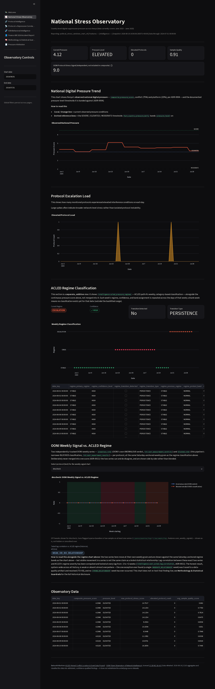
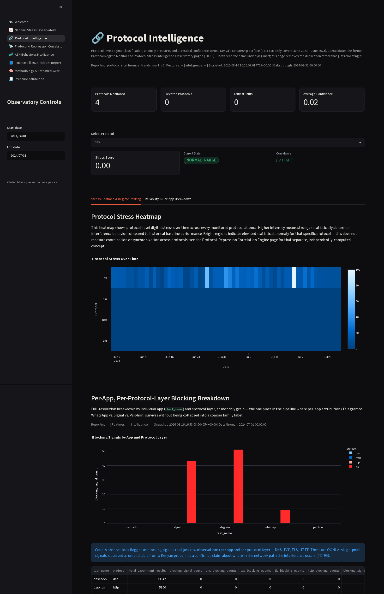
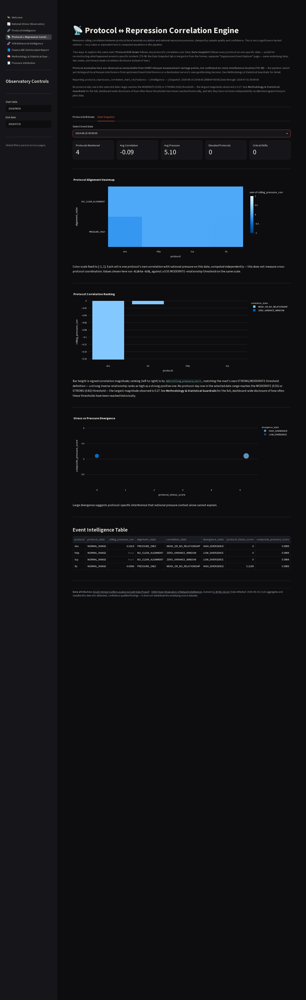
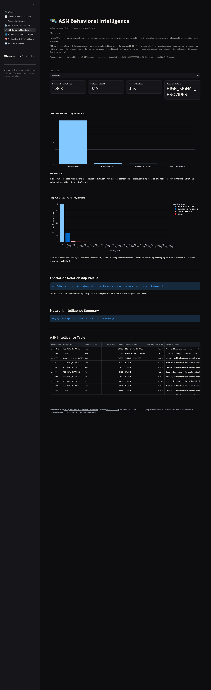
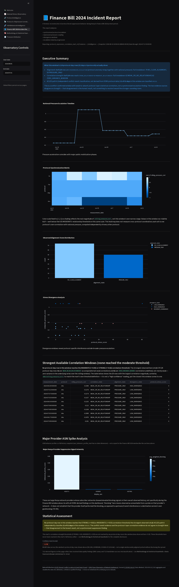
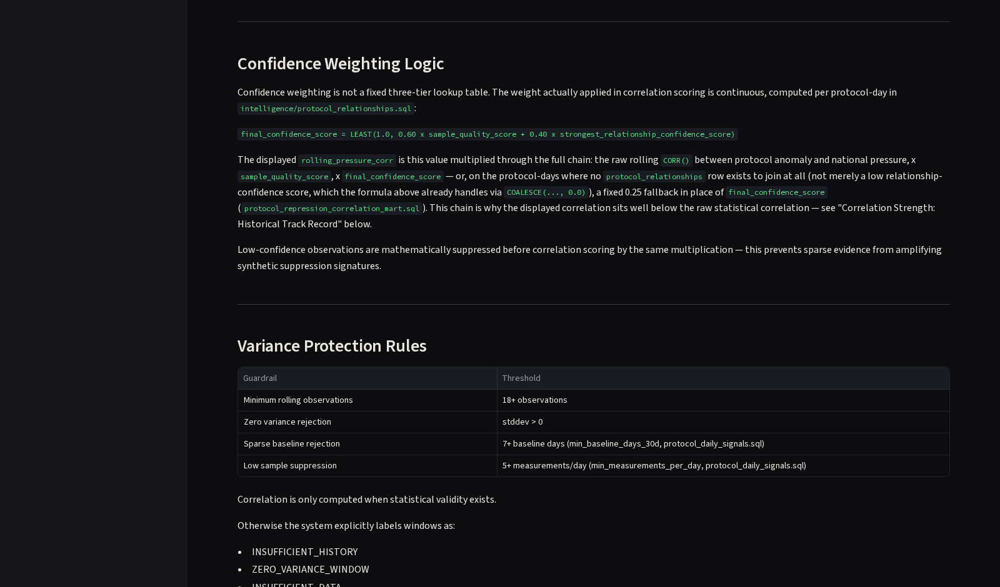
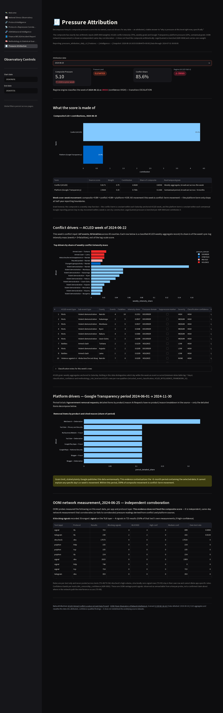

# CLIO — Civil Liberties Intelligence Observatory

> An active intelligence platform that fuses internet-censorship measurement (OONI), conflict and protest event data (ACLED), and platform/legal takedown-pressure signals (Google Transparency Report) into attributed, confidence-qualified findings about civil-liberties pressure. Kenya is the current pilot country — the methodology is built to generalize, not to stay Kenya-only.

[](https://www.python.org/)
[](https://getbruin.com/)
[](https://cloud.google.com/bigquery)
[](https://streamlit.io/)
[](https://www.terraform.io/)
[](https://duckdb.org/)
[](https://parquet.apache.org/)

## Scope

CLIO (Civil Liberties Intelligence Observatory) is Kenya-**piloted**, not Kenya-only. It combines network measurements, conflict indicators, legal-pressure signals, and platform transparency data into governed BigQuery marts and Streamlit intelligence views. Country, dataset, and date-range settings are pipeline configuration variables rather than hardcoded assumptions, so the same methodology is designed to extend to additional countries as they're onboarded.

Kenya's own data coverage is not a closed historical window, though it is honestly uneven across sources today: ACLED conflict-event history in the pipeline spans 1997 through 2026 and continues to extend as new weeks land, while the OONI/Google-Transparency-driven daily marts (the ones behind the composite pressure score) are currently bounded to a fixed June 2023 – June 2025 date-dimension window pending a data-spine widening — a real, disclosed limitation, not a claim that the project or its underlying measurement has stopped. This is an active, ongoing observatory, not a study that concluded in mid-2025. The project's flagship validated case study to date is the Finance Bill 2024 protests (see "Flagship Report" below), studied as one incident within that ongoing scope, not as its boundary.

The platform is designed to answer high-context analytical questions:

- Did network interference intensify during political stress windows?
- Which protocols showed abnormal censorship behavior?
- Which ASNs concentrated the strongest interference signals?
- Did pressure indicators align around the Finance Bill 2024 period?
- Which signals are statistically weak because of sparse data, low confidence, or zero variance?

The platform reconstructs civil-liberties pressure from historical and ongoing evidence; it does not perform live operational surveillance.

## Why This Matters

Digital repression is rarely observable through one clean dataset. It can appear as protocol anomalies, DNS or TCP failures, platform removals, legal pressure, protest dynamics, and inconsistent measurement coverage.

This project treats censorship analysis as an observability and inference problem. It fuses fragmented civil-liberties indicators into auditable statistical outputs, while preserving guardrails that prevent weak or sparse evidence from being overstated.

The result is a production-oriented reference architecture for civil-liberties observability, analytical inference, and governed public-interest intelligence reconstruction.

---

## Flagship Report: Finance Bill 2024

CLIO's first fully validated flagship deliverable reconstructs Kenya's June–July 2024 Finance Bill protests, connecting ACLED's categorical regime classification (a MOBILISATION reading from the Bill's May 11, 2024 tabling, escalating to CRISIS the week Parliament was stormed) and the platform's continuous composite pressure score — both substantially ACLED-driven by design (conflict intensity carries ~75-80% of the composite's weight; see "Pressure Attribution" below) — against OONI network-measurement corroboration, the report's one genuinely independent signal (a same-day spike in high-confidence DNS-blocking signals concentrated on Signal). The report deliberately discloses, rather than smooths over, a real methodological disagreement between the categorical and continuous scoring approaches during the same window.

Every quantitative figure was independently re-verified against live BigQuery data. Lumen/legal-pressure data is deliberately excluded from the report, since it remains synthetic pending a real Lumen export — see "Data Licensing & Attribution" below. The full analysis is built as `streamlit/pages/finance_bill_2024_incident_report.py`; see "Live Dashboard" below for current access status.

---

## Dashboard Showcase

### National Stress Observatory



Executive view of national digital-pressure movement, baseline divergence, suppression-window probability, and evidence quality across the Kenya observation window.

---

### Protocol Intelligence



Protocol-level regime classification for DNS, HTTP, TCP, and TLS — stress heatmap, per-protocol regime evolution, and current ranking in one tab; observation-reliability composition and the per-app/per-protocol-layer blocking breakdown (Telegram vs. WhatsApp vs. Signal vs. Psiphon) in the other. Consolidates what were two separate, largely-duplicative pages (TD-16) into one, removing the duplication rather than just relocating it.

---

### Protocol ↔ Repression Correlation Engine



Statistical alignment engine measuring whether protocol anomalies move with national repression-pressure indicators across rolling historical windows. Two tabs over the same underlying mart: **Protocol Drill-Down** follows one protocol's correlation over time; **Date Snapshot** follows every protocol on one specific date — useful for reconstructing what happened around a specific incident (TD-98: merged from the former, separate "Suppression Event Explorer" page — same data, two views, one honest weak-correlation disclosure instead of two).

---

### ASN Behavioral Intelligence



Network-level intelligence view ranking ASNs by blocking intensity, behavioral priority, evidence maturity, dominant protocol, and reliability of observed interference.

---

### Finance Bill 2024 Incident Report



Focused reconstruction of the Finance Bill 2024 period, connecting protocol behavior, national pressure signals, and major-provider activity during a known political stress window.

---

### Methodology & Statistical Guardrails



Methodology view documenting how sparse data, confidence weighting, variance checks, and rolling baselines constrain interpretation before signals enter intelligence outputs.

---

### Pressure Attribution



Decomposes CLIO's core cross-source pressure composite into its named, sourced arithmetic drivers (ACLED conflict intensity, Google Transparency platform pressure) for any date, with OONI shown as independent same-day corroboration rather than a composite input — an attributed, citable answer to "why is this composite at this level right now." The National Stress Observatory's own headline reading is a separate, faster-moving index that also draws on OONI signal directly; it is not yet decomposed on this or any dedicated view — read it as an early-warning flag, not (yet) a component-by-component explanation.

---

## Live Dashboard

Streamlit deployment:

https://civil-lliberties-intelligence-observatory-toafjdj5xoc.streamlit.app/

A dedicated Welcome page orients first-time visitors — what CLIO is, a one-line guide to every page, a suggested reading order by role (journalist/NGO/legal reader vs. methodology reviewer), and the key caveats stated upfront rather than discovered page-by-page.

Key intelligence surfaces (7 pages beyond Welcome):

- National Stress Observatory
- Protocol Intelligence (regime classification, stress heatmap, per-app blocking breakdown)
- Protocol ↔ Repression Correlation Engine (TD-98: two tabs — Protocol Drill-Down, Date Snapshot — merged from the former separate Suppression Event Explorer page)
- ASN Behavioral Intelligence
- Finance Bill 2024 Incident Report
- Methodology & Statistical Guardrails
- Pressure Attribution

---

## How Bruin Is Used

- Python ingestion assets
- SQL transformation assets
- Asset dependency orchestration
- Feature and intelligence materialization
- Validation and quality checks
- Historical partition execution
- BigQuery-backed marts
- Streamlit-facing reporting assets

---

## Architecture Overview


```mermaid
flowchart LR
    Sources["OONI, ACLED, Google Transparency, Lumen-style data"]
    Ingest["Python ingestion and Parquet normalization"]
    Warehouse["BigQuery staging, facts, dimensions, features"]
    Intelligence["Protocol regimes, lag relationships, pressure correlation"]
    Reporting["Dashboard-facing reporting marts"]
    Contracts["Streamlit query services and dataframe contracts"]
    Dashboard["Streamlit intelligence observatory"]

    Sources --> Ingest
    Ingest --> Warehouse
    Warehouse --> Intelligence
    Intelligence --> Reporting
    Reporting --> Contracts
    Contracts --> Dashboard
```

Design principles:

- Preserve source data as re-runnable analytical inputs.
- Separate ingestion, staging, features, intelligence, and reporting.
- Apply statistical guardrails before surfacing intelligence claims.
- Preserve mart versioning and snapshot metadata in the dashboard.
- Normalize BigQuery date and timestamp types before dashboard validation.
- Treat the system as historical reconstruction, not live surveillance.

**What DuckDB actually does here:** it is not a local analytics/querying layer a developer runs ad hoc — it's the connection Bruin's own CLI uses to execute this pipeline's `type: python` ingestion assets (the `duckdb-parquet` connection declared in `.bruin.yml`/`Bruin/pipeline.yml`), most visibly at the raw→load Parquet boundary (`raw.acled_conflict_events`, `raw.ooni_conflict_measurements`, and similar assets). Each of those assets runs inside its own ephemeral `uv`-managed environment that Bruin builds per `Bruin/requirements.txt` — a separate dependency surface from the top-level `pyproject.toml`/`uv.lock`, which governs local dev tooling (tests, Streamlit, `scripts/`) instead. Confirmed empirically 2026-08-02: `bruin run` against a `duckdb-parquet`-connected asset installs and uses whatever version `Bruin/requirements.txt` pins, independent of what (if anything) is installed in the top-level Python environment.

## Engineering Reliability Controls

| Control                              | Implementation                                                                                                                                                    |
| ------------------------------------ | ----------------------------------------------------------------------------------------------------------------------------------------------------------------- |
| Contract-enforced schema validation  | `streamlit/core/contracts.py` validates required columns, expected dtypes, and non-null fields for dashboard-facing marts.                                        |
| Environment portability              | `.env.example`, `streamlit/core/config.py`, `TARGET_ENV`, `BRUIN_ENV`, `GOOGLE_CLOUD_PROJECT`, country, date, and dataset settings support runtime configuration. |
| CI-backed verification               | `.github/workflows/lint.yml`, `.github/workflows/tests.yml`, and `tests/test_contracts.py` provide lint and contract-test entry points.                           |
| Query normalization                  | `streamlit/services/bq.py` normalizes BigQuery `DATE` and timestamp outputs before page rendering.                                                                |
| Sparse-window resilience             | Mart fetch contracts allow guarded statistical nulls where sparse history or zero variance makes inference unsafe.                                                |
| Dashboard contract safety            | `streamlit/services/marts.py` centralizes mart queries and validation before page code consumes results.                                                          |
| Service-layer separation of concerns | BigQuery execution, mart access, dataframe validation, reusable components, and page rendering are separated.                                                     |
| Deployment portability               | Dependency pins, `.env.example`, Terraform modules, and Codespaces reinstall commands reduce environment-specific breakage.                                       |

These controls are intended to keep the observatory stable across local development, Codespaces, and cloud-backed BigQuery execution.

## Repository Structure

Generated from the repository's tracked files (`git ls-files`), not the local working tree — some `docs/` subdirectories (internal planning and governance material) are deliberately excluded from the public repository via `.gitignore` and will not appear on a fresh clone.

```text
.
|-- Bruin/
|   |-- pipeline.yml
|   |-- requirements.txt
|   |-- config/
|   |   `-- observatory.yml
|   |-- scripts/
|   |   |-- country_literal_check/    # CI guard against hardcoded country literals
|   |   |-- historical_initializer/   # ACLED regime engine backfill driver
|   |   |-- staleness_check/          # Materialization-staleness CI guard
|   |   `-- steady_state/             # Resolves and runs the single next unprocessed
|   |                                 # ACLED regime week (TD-38) -- never bare `bruin run`
|   `-- assets/
|       |-- ingest/          # Raw source ingestion assets (OONI, ACLED, Google, Lumen)
|       |-- load/            # GCS and BigQuery external table loaders
|       |-- staging/         # Source normalization models
|       |-- intermediate/    # Cross-source preparation models
|       |-- marts/
|       |   |-- dims/        # Conformed dimensions
|       |   `-- facts/       # Analytics-ready fact tables
|       |-- features/        # Model-ready protocol and pressure features
|       |-- intelligence/    # Regime classification and relationship inference
|       `-- reporting/       # Dashboard-facing marts, incl. pressure-attribution
|-- .env.example             # Portable environment variable template
|-- .github/
|   `-- workflows/
|       |-- lint.yml                    # CI lint scaffolding
|       |-- tests.yml                   # CI test scaffolding
|       |-- gcp-auth.yml                # Workload Identity Federation auth check
|       |-- staleness-check.yml         # Materialization-staleness CI job
|       `-- country-literal-check.yml   # Hardcoded-country-literal CI guard
|-- docs/
|   |-- 02-architecture/     # ADRs, architecture assessment, decision log, TD inventory,
|   |   |                    # data-modelling.md, data_sources.md, erd-lineage.md
|   |   `-- adr/             # Accepted architecture decision records
|   `-- 03-development/      # Coding standards, testing strategy, documentation standards
|-- Archive/                 # Superseded docs, kept (not deleted) with an explanation
|   `-- README.md            # of what each archived file was and what replaced it
|-- infra/
|   |-- main.tf
|   |-- provider.tf
|   |-- variables.tf
|   |-- setup-gcp.sh
|   |-- verify-gcp.sh
|   `-- modules/
|       |-- bigquery/
|       |-- gcs/
|       `-- iam/
|-- scripts/
|   |-- download_ooni.ps1
|   |-- local_ingest_ooni.py
|   |-- lumen_parquet.py
|   `-- ooni_api_validation.py     # Live cross-check against OONI's own API (rate-limited, disk-cached)
|-- streamlit/
|   |-- app.py                # Thin st.navigation entrypoint - pages own their
|   |   |                     # title/icon via st.Page(), not filename parsing
|   |-- requirements.txt
|   |-- pages/                # Welcome + 7 pages: National Stress Observatory,
|   |   |                     # Protocol Intelligence (consolidated, TD-16),
|   |   |                     # Protocol Repression Correlation Engine (two tabs,
|   |   |                     # merged with the former Suppression Event Explorer
|   |   |                     # page, TD-98), ASN Behavioral Intelligence, Finance
|   |   |                     # Bill 2024 Incident Report, Methodology &
|   |   |                     # Statistical Guardrails, Pressure Attribution
|   |-- services/
|   |   |-- bq.py
|   |   |-- marts.py
|   |   `-- freshness.py
|   |-- core/
|   |   |-- config.py
|   |   |-- constants.py
|   |   |-- contracts.py
|   |   |-- filters.py
|   |   |-- layout.py
|   |   |-- state.py
|   |   `-- theme.py
|   |-- components/
|   |   |-- charts.py
|   |   |-- kpis.py
|   |   |-- status.py
|   |   |-- tables.py
|   |   `-- trust.py          # ACLED/OONI attribution footer
|   `-- assets/
|       |-- annotations/
|       `-- methodology/
|           `-- thresholds.yml
|-- tests/
|   |-- fixtures/
|   |   `-- acled_regimes_golden/            # Golden-file fixtures for regime classification
|   |                                        # (Finance Bill 2024, Jan-Feb 2008)
|   |-- test_contracts.py                    # Dashboard contract validation tests
|   |-- test_acled_pressure_regimes_golden.py
|   |-- test_ooni_dns_bogon_classification.py
|   |-- test_ooni_dns_canary_classification.py
|   |-- test_ooni_tls_handshake_success_fix.py
|   |-- test_ooni_tls_failure_evidence_tiering.py
|   `-- test_ooni_tls_root_ca_exclusion.py
|-- pyproject.toml
|-- uv.lock
`-- README.md
```

---

## Quickstart

### 1. Clone

```bash
git clone https://github.com/Sanjomwa/Civil-Liberties-Intelligence-Observatory.git
cd Civil-Liberties-Intelligence-Observatory
```

### 2. Create a Python Environment

Using standard `venv`:

```bash
python -m venv .venv
source .venv/bin/activate
python -m pip install --upgrade pip setuptools wheel
python -m pip install --no-cache-dir -r streamlit/requirements.txt
```

Using `uv`:

```bash
uv venv
source .venv/bin/activate
uv pip install -r streamlit/requirements.txt
```

On Windows PowerShell:

```powershell
python -m venv .venv
.\.venv\Scripts\Activate.ps1
python -m pip install --upgrade pip setuptools wheel
python -m pip install --no-cache-dir -r streamlit\requirements.txt
```

### 3. Dependency Compatibility

`streamlit/requirements.txt` pins NumPy below 2.0 to avoid ABI conflicts with `pyarrow`/`google-cloud-bigquery`:

```text
numpy>=1.26.4,<2.0
```

(A prior version of this section also described pinned `shapely`/`geopandas` versions for a geospatial stack — corrected here: neither package appears anywhere in `streamlit/requirements.txt`, `pyproject.toml`, `uv.lock`, or the `streamlit/` codebase today. There is no map-rendering dependency in this project currently.)

If dependency state is stale, rebuild the virtual environment and reinstall from `streamlit/requirements.txt`.

### 4. Environment Variables

Replace these values for your own deployment.

```bash
export GOOGLE_CLOUD_PROJECT="encoded-joy-485413-k5"
export GCP_PROJECT_ID="encoded-joy-485413-k5"
export GCS_BUCKET="civil-liberties-data"
export TARGET_ENV="staging"
export BRUIN_ENV="dev"
export COUNTRY="Kenya"
export ISO2="KE"
export DEFAULT_START="2023-06-01"
export DEFAULT_END="2025-06-30"
```

PowerShell:

```powershell
$env:GOOGLE_CLOUD_PROJECT = "encoded-joy-485413-k5"
$env:GCP_PROJECT_ID = "encoded-joy-485413-k5"
$env:GCS_BUCKET = "civil-liberties-data"
$env:TARGET_ENV = "staging"
$env:BRUIN_ENV = "dev"
$env:COUNTRY = "Kenya"
$env:ISO2 = "KE"
$env:DEFAULT_START = "2023-06-01"
$env:DEFAULT_END = "2025-06-30"
```

The Streamlit configuration also supports `.env` values and Bruin configuration defaults.

### 5. Authenticate BigQuery

For local development:

```bash
gcloud auth application-default login
gcloud config set project encoded-joy-485413-k5
```

For service-account based execution:

```bash
export GOOGLE_APPLICATION_CREDENTIALS="/path/to/service-account.json"
gcloud auth activate-service-account --key-file "$GOOGLE_APPLICATION_CREDENTIALS"
gcloud config set project encoded-joy-485413-k5
```

### 6. Install Bruin

```bash
curl -LsSf https://getbruin.com/install/cli | sh
bruin --version
```

The Bruin pipeline expects these connection names:

- `bigquery-default`
- `duckdb-parquet`

### 7. Prepare Source Data

Four sources feed the pipeline. Their raw-ingest assets expect real, specific local files — the exact expected filenames and destination paths below are taken directly from each asset's own code (`Bruin/assets/ingest/*.py`), not paraphrased.

| Source | Required? | Where to get it | Exact expected path |
|---|---|---|---|
| **ACLED** | Yes — feeds the conflict-pressure/regime-classifier chain | [ACLED's Data Export Tool](https://acleddata.com/data-export-tool/) (free registration required for non-commercial use; a separate paid Commercial License Agreement applies for commercial use — see `docs/02-architecture/data_sources.md`) | `data/dev/acled/Africa_aggregated_data_up_to_week_of-2026-03-14.csv` |
| **OONI** | Yes — feeds the protocol/censorship-measurement chain, the dashboard's primary evidence source | OONI's own data-access channels (OONI API/Explorer, `ooni.org/data`; rate-limited and, per this project's own licensing review, not designed for bulk historical extraction). **This repository does not document exactly how the currently-used `.jsonl.gz` files were originally obtained** — flagging that plainly as a real reproducibility gap rather than implying a verified path | `.jsonl.gz` files under `data/dev/ooni/ooni-kenya-censorship/`, normalized by `raw.ooni_conflict_measurements` into `data/dev/ooni/ooni_measurements.parquet` |
| **Google Transparency Report** | Feeds `platform_pressure_score` and the pressure-attribution platform-drivers mart; the pipeline can be scoped to skip it (see below) | Google's Transparency Report government-requests pages, CSV export per report type (no official bulk API confirmed — see `docs/02-architecture/data_sources.md`) | `data/dev/google/google-government-removal-requests.csv` and `data/dev/google/google-government-detailed-removal-requests.csv` |
| **Lumen** | No — nothing to obtain | N/A. `raw.lumen_requests` fabricates its rows in code (`np.random.seed(42)`, deterministic); it does not read any external file. This branch is also formally excluded from the composite pressure score (ADR-0004) — it materializes but nothing live reads it. | N/A |

**A real, disclosed reproducibility limitation:** the ACLED and Google Transparency ingest scripts read from a hardcoded absolute path (`/workspaces/Civil-Liberties-and-Censorship-Analysis-with-Bruin/data/dev/...`), not a path computed relative to the repository root — a clone at any other location will need to either replicate that exact path or edit the script. The OONI ingest asset does not have this problem (`Path(__file__).resolve().parents[3]`, computed relative to its own file location). **If you don't have ACLED registration or a documented path to OONI's raw historical export, you cannot reproduce the full pipeline end-to-end** — this is a genuine boundary, not a "just clone and run" claim. A partial run scoped to whichever source(s) you do have real data for is possible via Bruin's `--selector`/`--exclude-tag`/`--tag` flags (`bruin run --help`), since Bruin's DAG only materializes an asset once its declared dependencies exist — running the full `pipeline.yml` default against incomplete source data will halt at the first missing upstream asset, not degrade gracefully.

See `docs/02-architecture/data_sources.md` for full per-source licensing, grain, and known-limitation detail, and `docs/02-architecture/data-modelling.md` for schema/modeling detail.

### 8. Run Bruin

From the repository root:

```bash
cd Bruin
bruin run pipeline.yml
```

Example targeted runs:

```bash
bruin run assets/features/protocol_daily_signals.sql
bruin run assets/intelligence/protocol_relationships.sql
bruin run assets/reporting/protocol_repression_correlation_mart.sql
```

### 9. Launch Streamlit

From the repository root:

```bash
cd streamlit
python -m streamlit run app.py
```

Open:

```text
http://localhost:8501
```

### 10. Codespaces Clean Reinstall

```bash
cd /workspaces/Civil-Liberties-and-Censorship-Analysis-with-Bruin
deactivate 2>/dev/null || true
rm -rf .venv
python -m venv .venv
source .venv/bin/activate
python -m pip install --upgrade pip setuptools wheel
python -m pip install --no-cache-dir -r streamlit/requirements.txt

python - <<'PY'
import numpy
from google.cloud import bigquery
print("numpy", numpy.__version__)
print("bigquery import ok")
PY

cd streamlit
python -m streamlit run app.py
```

Expected NumPy version:

```text
1.26.x
```

---

## Data Model and Methodology

Four sources feed the pipeline today — OONI, ACLED, Google Transparency Report, and a currently-synthetic, benched Lumen branch — through seven layers (raw → staging → intermediate → features → intelligence → marts → reporting). Full detail lives in three dedicated documents rather than duplicated here, so this section doesn't become a second, silently-drifting copy of them:

- **[`docs/02-architecture/data_sources.md`](docs/02-architecture/data_sources.md)** — every source's real grain, licensing status, and ingestion path, plus which additional sources (STOP/Access Now, CPJ, IODA, Freedom House) are recommended but not yet ingested.
- **[`docs/02-architecture/data-modelling.md`](docs/02-architecture/data-modelling.md)** — the live dimension/fact/reporting schema, with a Mermaid ER diagram generated from the actual BigQuery schema, and a documented gotcha (two different `composite_pressure_score` formulas share a column name across two tables — see that doc before assuming which one you're reading).
- **[`docs/02-architecture/erd-lineage.md`](docs/02-architecture/erd-lineage.md)** — the full pipeline dependency graph per source, generated from the live Bruin DAG, including the two guardrails that keep it from silently corrupting (the ACLED regime engine's execution-order precondition, and the materialization-staleness CI check).

### Statistical Methodology

The platform uses guarded statistical inference rather than raw-count interpretation.

Core methods:

- Rolling baselines compare current pressure against recent historical behavior.
- Anomaly scoring measures protocol deviation from expected signal patterns.
- Sparse-window suppression prevents weak evidence from producing strong claims.
- Confidence weighting gives stronger influence to higher-quality observations.
- Variance guardrails suppress correlation claims when statistical windows collapse.
- Protocol inference evaluates DNS, HTTP, TCP, and TLS regime behavior.
- Pressure correlation modeling aligns protocol anomalies with national pressure signals.

Correlation outputs include:

- `SYNCHRONIZED_ESCALATION`
- `INVERSE_MOVEMENT`
- `PROTOCOL_DIVERGENCE`
- `PRESSURE_ONLY`
- `NO_CLEAR_ALIGNMENT`

These states are analytical indicators, not causal findings.

## Validation and Contracts

The repository includes Bruin validation assets, Streamlit dataframe contracts, and pytest-based contract checks.

Bruin validation assets:

- `features.validate_protocol_daily_signals`
- `intelligence.validate_ooni_intelligence_contracts`

Streamlit contract layer:

- validates required mart columns
- coerces date and timestamp fields
- coerces numeric display fields
- supports string ASNs
- permits valid sparse-window nulls
- returns empty dataframes only for true contract failures

Automated test entry point:

```bash
pytest -q
```

Lint entry point:

```bash
ruff check .
```

### Validation History

Run commands and asset names tell you validation *exists*; they don't tell you what's actually been checked or what came back. This section states that plainly, with real numbers, not vague claims — full detail lives in `docs/02-architecture/technical-debt-inventory.md` and `docs/02-architecture/decision-log.md`; this is the top-line summary, not a duplicate of either.

**ACLED regime classifier — golden-file regression tests.** `tests/test_acled_pressure_regimes_golden.py` asserts the ACLED "Path A" regime classifier's output against recorded fixtures for two real historical windows: the Finance Bill 2024 protests (2024-05-11 to 2024-07-13) and the Jan–Feb 2008 post-election violence. This is a drift check against already-validated, materialized BigQuery output, gated behind an opt-in `RUN_BIGQUERY_TESTS=1` environment variable — without it, both tests skip cleanly (2 skipped, offline, well under 1 second); re-run live for this section (2026-08-02) with the flag set and real BigQuery access, both windows pass (2 passed, ~12 seconds). The repository's full test suite (`pytest -q`, also re-run live for this section) currently reports 16 passed, 15 skipped — the skips are exclusively the BigQuery-gated tests across several files, not failures.

**A disclosed, self-found bug: 91.5% of the TLS observation table was misclassified for months.** `stg.ooni_tls_observations.handshake_success` was structurally `NULL` for 100% of 422,487 rows across every ingested app (Signal, WhatsApp, Telegram, Psiphon) — the extraction read a JSONPath (`$.status.success`) that belongs to a different OONI data shape than TLS handshake objects actually have. The consequence: 386,617 of 422,487 rows (91.5%) that should have read `OK` (a genuinely successful handshake) instead fell through to `UNKNOWN`. Found and fixed on this project's own initiative — not flagged by an outside party — and disclosed here rather than left to be found later in the commit history. Full before/after numbers per app, and the downstream cascade this fix was traced through, are in `technical-debt-inventory.md`'s TD-72 entry.

**External validation against OONI's own live API (2026-08-01), not just this project's own tables.** A dedicated validation pass checked CLIO's TLS classification against OONI's raw measurement JSON directly, across four independent strata (~1,054 live API calls against `api.ooni.org`, rate-limited, disk-cached):

- **Core premise: 100/100 exact matches.** Sampled rows CLIO moved `UNKNOWN`→`OK` were checked against OONI's raw JSON at the exact recorded offset — did `failure` actually show present-and-null, or was an extraction miss silently read as a false success? Zero divergences.
- **Extractor verbatim match: 113/113.** Every available row for CLIO's four re-tiered TLS failure modes matched OONI's raw `failure` string exactly.
- **All 361 real `BLOCKED` rows individually checked, not sampled.** 281/361 (77.8%) directly agree with OONI's own `anomaly=true` flag. The remaining 80 all carry OONI's own `scores.accuracy = 0.0` — pulled and checked against OONI's documented known-bad-probe-version gates: 80/80 matched at least one gate, meaning OONI itself never reached a "not blocked" verdict for any of them, rather than disagreeing with CLIO. Effective agreement among rows OONI scored with confidence: 281/281 = 100%.
- **Residual sample (informational): 99/100.** A sample of the remaining ambiguous `ssl_*` `UNKNOWN` rows would be discarded by the same known-bad-probe-version table — a concrete, evidence-backed lead for a still-open confidence-elevation question, not itself a pass/fail check.

Full stratum-by-stratum methodology is in `decision-log.md`'s 2026-08-01 (fifth session) entry.

**ACLED ingestion-layer fidelity audit (2026-08-02).** A separate check of whether the ACLED ingestion pipeline (`raw.acled_conflict_events` → `load.acled_conflict_events_to_gcs` → `stg.acled_conflict_events`) transcribes ACLED's own export data faithfully, one layer upstream of the regime-classifier tests above. Checked field-by-field for the Finance Bill 2024 window and two quiet control periods (the Aug 2010 constitutional referendum and the Sept 2017 Supreme Court election annulment): row counts, fatality sums, event/sub-event-type coding, date/week-anchor alignment, and county (`admin1`) coverage all matched exactly, including a full row-level equality diff beyond the requested aggregate checks (0 mismatches, either direction, in every window), and the same result held at the full 267,956-row, 58-country dataset level. **One honestly-disclosed gap, not smoothed over:** the original ACLED CSV that `raw.acled_conflict_events` reads wasn't available in that session's environment, so the earliest ingestion leg (CSV → Parquet) was verified by code inspection — a pure 1:1 column rename with no computation — rather than an executed byte-level diff. Full results are in `decision-log.md`'s 2026-08-02 entry.

This project also runs a periodic guardrail that re-checks a sample of its OONI-based classifications against OONI's own published measurement data, to catch drift or regressions in how CLIO interprets raw network measurements. See `docs/02-architecture/adr/0013-ooni-agreement-check-external-reference-oracle-guardrail.md` for the full design, including how the check panel is chosen and why it's kept public.

## Infrastructure and Deployment

Terraform under `infra/` provisions the cloud backbone:

- Google Cloud Storage bucket
- BigQuery staging and production datasets
- IAM bindings

Deployment portability is supported through:

- environment variable configuration
- `.env.example`
- Terraform modules
- pinned dashboard dependencies
- CI lint and test workflows

Additional production controls may include: secret management, least-privilege IAM, remote Terraform state, authenticated dashboard hosting, and BigQuery cost controls.

## Roadmap

Near-term platform evolution:

- Multi-country expansion using configurable country, dataset, and date settings
- Deeper mart contract coverage across all dashboard-facing models
- Evidence lineage tracing from dashboard scores back to source records
- Deployment hardening for authenticated cloud hosting
- Reporting API layer over curated marts

## Responsible Use

This system is observational and historical. It does not identify individuals, track users, exploit networks, or provide real-time operational surveillance.

- **No individual attribution.** Only aggregated, publicly available datasets are used; there is no ingestion of personally identifiable information and no attempt to de-anonymize or infer identities. All analysis operates at country, network, or platform level — never at the level of a specific person, activist, or journalist.
- **No political stance embedded.** The models measure signals, not blame. Outputs are evidence-weighted indicators, not definitive proof of intent or causality, and should not be read as an accusation or endorsement.
- **No exploitation tooling.** Nothing in this repository is designed to exploit vulnerabilities, target infrastructure, or enable censorship. The system is observational, not operational.
- **Responsible interpretation is expected of anyone using this project's outputs** — avoid misrepresenting findings, avoid unsupported conclusions, and never use outputs to justify harm, discrimination, or misinformation.

Civil-liberties analysis requires context, source awareness, and careful communication: observed correlations (e.g. conflict alongside blocking) do not imply direct causation, and results should be interpreted alongside political context, legal frameworks, and known infrastructure limitations.

## Data Licensing & Attribution

CLIO's evidence sources carry their own, separate licensing terms, re-verified directly from primary sources:

- **OONI** — CC BY-NC-SA 4.0 (Attribution-NonCommercial-ShareAlike).
- **ACLED** — a contractual, non-Creative-Commons license: free for non-commercial use with registration; commercial use requires a separate paid license from ACLED.
- **Google Transparency Report** — no source-specific reuse license could be located despite direct search; status is **Cannot Determine**, not assumed compliant.
- **Lumen Database** — the platform's current Lumen-derived figures are synthetic placeholders, not real Lumen data, and are excluded from all live output (see "Data Model and Methodology" above).

Because of the OONI and ACLED terms above, **CLIO's OONI- and ACLED-derived intelligence layer is treated as non-commercial and grant/public-interest-funded for the foreseeable term, not as a product for direct sale.** This project does not redistribute the underlying third-party datasets — only transforms them into attributed, confidence-qualified findings — but transformation does not, on its own, remove either source's NonCommercial restriction. The Finance Bill 2024 flagship report is released as free public-interest research, not a paid deliverable.

This posture governs CLIO's data and findings; it is separate from the MIT license on this repository's own code (see below).

**Before relying on any CLIO finding commercially** — including in a paid engagement, product, or service — contact the maintainer first (see below). CLIO's current default is non-commercial; nothing in this repository should be read as a license to resell OONI- or ACLED-derived findings.

## How to Cite CLIO

If citing CLIO's findings in research, journalism, or advocacy work:

> CLIO (Civil Liberties Intelligence Observatory), Samwel Njogu, [github.com/Sanjomwa/Civil-Liberties-Intelligence-Observatory](https://github.com/Sanjomwa/Civil-Liberties-Intelligence-Observatory). Accessed [date]. Findings derived from OONI (CC BY-NC-SA 4.0) and ACLED (contractual, non-commercial by default) — see "Data Licensing & Attribution" above for each source's own required citation elements.

Findings that draw on ACLED or OONI data should also carry each source's own required attribution (ACLED: access date, filters/subset used, and any manipulation performed; OONI: credit, license link, and any changes made) — not CLIO's citation alone. See "Data Licensing & Attribution" above.

## Attribution and License

Maintained by Samwel Njogu  
X: [@sam_njogu9](https://x.com/sam_njogu9)

Built as a civil-liberties observability platform — currently piloted in Kenya — using Bruin, BigQuery, Streamlit, Terraform, Python, OONI, ACLED, and Google Transparency Report data. A Lumen-derived legal-pressure signal exists in the pipeline but is currently synthetic and benched from all live output (see "Data Licensing & Attribution" above).

This repository's own code is licensed under the MIT License. Third-party data sources retain their own separate licensing terms — see "Data Licensing & Attribution" above.
