# CLIO Data Modelling

Status: rewritten 2026-07-12, refreshed 2026-08-02 to add `dim_tls_failure_evidence` (shipped 2026-08-01, TD-71) and the `handshake_success` fix's consequence (2026-08-01, repo's-own-TD-72), and refreshed again 2026-09-03 to add `dim_ooni_probe_version_accuracy`, `dim_tcp_failure_evidence`, `features.ooni_weekly_signals`, and `intelligence.ooni_acled_lag_correlation` (all shipped since the 2026-08-02 pass, TD-80/TD-87/TD-91-era work) — each refresh re-verified live against the current schema and DAG (`INFORMATION_SCHEMA.COLUMNS` against `encoded-joy-485413-k5`, `bruin validate`), not hand-edited from memory of what changed. **The "55/55" figure cited by the 2026-08-02 refresh is now stale**: `bruin validate` as of 2026-09-03 reports **68 assets clean** (55 `.sql` files + 13 `.py` files under `Bruin/assets/`, confirmed via direct `find`/`grep` count), a real 13-asset net growth since 2026-08-02, not just the 4 tables named above — the rest is largely the TD-87/TD-91 OONI verdict/candidate-guard branch (`stg.ooni_measurement_summary`, `int.ooni_measurement_verdicts_candidate`, `int.ooni_measurement_verdicts_confirmed_guard`, `int.ooni_measurement_verdicts`) plus validation/check assets (`intelligence.acled_pressure_regimes_precondition_check`, `intelligence.country_initialization_status`, `intelligence.country_readiness`) not all of which materialize as analytical tables this document's own scope covers (see the note under "Features and Intelligence" below). Originally grounded directly in the live BigQuery schema and the live Bruin DAG (54/54 assets clean 2026-07-12). See `architecture-assessment.md` for the broader system design and `erd-lineage.md` for the full pipeline lineage; this document covers the marts/dims/facts layer specifically.

BigQuery does not enforce foreign-key constraints — every relationship below is an analytical join relationship (confirmed against each asset's actual SQL, not assumed from column-name similarity), not a database-enforced one.

## Layer architecture

Bruin materializes seven layers, in dependency order:

| Layer | Purpose | BigQuery dataset |
|---|---|---|
| Raw | Land source data with minimal transformation, preserving re-runnable inputs | `raw` |
| Load | Move raw files to GCS, the boundary between local ingestion and warehouse | (GCS, no BigQuery dataset) |
| Staging | Normalize field names/types per source, one asset per raw feed | `stg` |
| Intermediate | Cross-source or cross-grain preparation (event classification, periodization) | `int` (a Bruin-internal prefix, not a literal BigQuery dataset — resolves into `marts`/`features`/`intelligence` outputs) |
| Marts | Conformed dimensions and analytics-ready fact tables | `marts` |
| Features | Model-ready statistical features (baselines, anomaly scores, guardrail flags) | `features` |
| Intelligence | Inference over regimes and relationships (classification, correlation) | `intelligence` |
| Reporting | Streamlit-facing marts, the only layer the dashboard queries directly | `reporting` |

## Live dimensions

**Corrected 2026-09-03: nine dimension tables**, not seven, are materialized in `marts` today (confirmed via `git ls-files Bruin/assets/marts/dims/` and a live schema query against `encoded-joy-485413-k5.marts.INFORMATION_SCHEMA.TABLES`) — two rows below (`dim_ooni_probe_version_accuracy`, `dim_tcp_failure_evidence`) were missing from this table before this pass:

| Dimension | Grain | Status |
|---|---|---|
| `dim_dates` | one row per calendar date | Live, consumed. **Bounded to 2023-06-01–2025-06-30** — this is the actual constraint behind every OONI/Google-Transparency-driven mart's date coverage; widening it is a real, not-yet-scheduled data-spine change. |
| `dim_asn` | one row per ASN | Live, consumed (`reporting.asn_behavior_profile_mart`, joins from `features.protocol_daily_signals`). |
| `dim_country` | one row per country | Live, but **zero external consumers today** — deliberately kept anyway (TD-59) as the canonical country-normalization dimension and the scaffolding point for multi-country expansion (TD-09). Repointed 2026-07-06 from the now-retired `int.ooni_signals` to `int.ooni_experiment_results`. |
| `dim_censorship_confidence` | one row per confidence tier (HIGH/MEDIUM/LOW/INSUFFICIENT_DATA) | Live, consumed — the canonical confidence-bucketing reference (ADR-0001/TD-05), joined via `LEFT JOIN ... QUALIFY ROW_NUMBER()` rather than duplicated bucketing logic. |
| `dim_measurement_quality` | one row per quality tier | Live, consumed. |
| `dim_blocking_signals` | one row per blocking-signal type | Live in schema, **zero external consumers** (TD-59, low severity, deliberately not yet retired — "when next touching the marts layer, decide"). |
| `dim_tls_failure_evidence` | one row per `tls_failure` string (6 rows, built from the exact values observed live in Kenya's TLS data as of 2026-08-01, not the full OONI spec vocabulary) | Live, consumed. Shipped 2026-08-01 (TD-71) to replace a flat `ELSE 0.45` confidence collapse in `int.ooni_experiment_results.sql`'s `tls` CTE with per-failure-mode weights (`connection_reset` 0.60, `eof_error`/`connection_aborted` 0.50, `ssl_invalid_certificate`/`ssl_unknown_authority` 0.45 unchanged, `generic_timeout_error` 0.40), sourced against `ooni/spec`'s `df-007-errors.md`. Joined via exact string match on `tls_failure` (`stg.ooni_tls_observations.tls_failure = dim_tls_failure_evidence.tls_failure`), consumed through `COALESCE(tls_failure_standalone_confidence, 0.45)` — any `tls_failure` string absent from this table (today or introduced later by OONI) silently keeps the pre-fix 0.45 floor rather than inheriting an elevated tier. Externally validated 2026-08-01 against OONI's own live API: the `tls_failure` extractor this table joins against matched OONI's raw JSON verbatim for 113/113 available re-tiered rows. |
| `dim_tcp_failure_evidence` | one row per TCP connect failure string | Live, consumed. Shipped 2026-08-15 (TD-80), same join shape as `dim_tls_failure_evidence` (`LEFT JOIN` on exact failure string) but also supplies `result_state`/`blocking_detail`, not just `confidence_score` — replaces a `LIKE '%timeout%'` substring match in `int.ooni_experiment_results.sql`'s `tcp` CTE that missed the literal OONI failure string `timed_out`, which had left 16 live rows falling through to a generic `UNKNOWN` instead of `DOWN`. |
| `dim_ooni_probe_version_accuracy` | one row per known-bad probe version / test combination OONI's own backend discards before scoring | Live, consumed. Shipped 2026-08-15 (TD-87 Phase 2), grounding a real, earlier-measured finding (80/361 BLOCKED TLS rows and 99/100 residual `ssl_*` UNKNOWN rows carried OONI's own `scores.accuracy = 0.0`) directly against OONI's own published discard rule (`ooni/pipeline`'s `fastpath/core.py`, `score_signal()`), not reinvented or derived empirically. |

**Retired, do not treat as live**: `dim_platforms`, `dim_reasons`, `dim_regions`, `dim_requestors` — all four deleted (asset file removed, table dropped) in the 2026-07-06 cost-audit cleanup pass (TD-56), after direct consumer-tracing found zero external references to any of them. If you see them referenced in older documentation (including the archived pre-restructure docs this file replaces), that documentation is describing a state that no longer exists.

## Live facts

| Fact | Grain | Purpose |
|---|---|---|
| `marts.fact_country_pressure_daily` | one row per `measurement_date` | The national daily composite pressure score and its inputs (conflict/legal/platform pressure sub-scores), plus broadcast ACLED regime columns (`regime_*`, Saturday-anchored). Bounded by `dim_dates`. |
| `marts.fact_ooni_censorship_signals` | one row per OONI experiment result | Analytics-ready OONI blocking-signal events, the base for `features.protocol_daily_signals`. Its upstream source, `stg.ooni_tls_observations.handshake_success`, was structurally dead (NULL for 100% of 422,487 rows) until 2026-08-01 (repo's-own-TD-72); now derived from `tls_failure IS NULL`, which moved 386,617 rows (91.5% of the TLS observation table) from `UNKNOWN` to the correct `OK` state. |
| `marts.fact_protocol_blocking_summary` | one row per `(month_date, test_name, protocol)` | Monthly protocol-blocking rollup, feeds page 3's per-app panel (TD-51). |
| `marts.fact_takedown_activity` | one row per `(source, platform, reason, measurement_date)` | Google Transparency + (synthetic) Lumen takedown activity — the dead-end Branch A of TD-01's Lumen investigation; still materializes, nothing downstream reads it live. |
| `marts.fact_takedown_pressure_daily` | one row per `(source, measurement_date)` | Daily rollup of the above; same dead-end status. |

**Retired**: `fact_conflict_events` (TD-41, deleted — had been silently producing zero rows for a month after commit `6dbe7ab` broke its filter, decided not worth fixing since it predates ACLED path A's rigor and had zero consumers), `fact_asn_repression_index` and `fact_network_blocking_daily` (TD-56, zero consumers).

## Features and Intelligence

| Asset | Grain | Purpose |
|---|---|---|
| `features.protocol_daily_signals` | `(measurement_date, protocol, test_family, asn)` | Rolling baselines, z-scores, anomaly scores, and guardrail flags (sparse-window, zero-variance, low-sample) per protocol per ASN per day. |
| `features.acled_pressure_signals` | `week_start_date` | Weekly-aggregated conflict pressure indices, baselines, and guardrail flags — ACLED's real coding cadence, not artificially coarsened. |
| `intelligence.protocol_signal_regimes` | `(measurement_date, protocol, asn)` | Protocol-level regime classification (state, confidence) from `features.protocol_daily_signals`. |
| `intelligence.protocol_relationships` | `(measurement_date, protocol, asn)` | Cross-protocol relationship/lag inference, built from `protocol_signal_regimes` + `protocol_lag_relationships`. |
| `intelligence.protocol_lag_relationships` | `(measurement_date, target_protocol, driver_protocol, asn)` | Pairwise lag-correlation analysis between protocols. |
| `intelligence.acled_pressure_regimes` | `week_start_date` | The ACLED "Path A" categorical regime classifier (STABLE/ESCALATION/CONFLICT/CRISIS/MOBILISATION). Governed by an EXECUTION CONTRACT precondition — see `erd-lineage.md`. Not bounded by `dim_dates`; spans 1997-01-11–2026-03-14 live. |
| `features.ooni_weekly_signals` | `(week_start_date, test_name)` | **Added 2026-09-03, missing from this table before this pass.** Weekly OONI signal aggregation, Saturday-anchored to match `acled_pressure_regimes`'s own week boundary (ADR-0011). Carries two independent, never-merged column groups: `anomalous_*` (from `int.ooni_measurement_verdicts`, OONI's own OK/CONFIRMED/ANOMALOUS/FAILED vocabulary) and `blocked_*` (from `int.ooni_experiment_results`, CLIO's own `result_state` derivation). |
| `intelligence.ooni_acled_lag_correlation` | `(week_start_date, test_name, series_type, lag_weeks)` | **Added 2026-09-03, missing from this table before this pass.** Lag-tested correlation (0, ±1, ±2 weeks) between each of `features.ooni_weekly_signals`'s two independent series and `acled_pressure_regimes`'s weekly classification, computed separately per `series_type` (`ANOMALOUS` or `BLOCKED`) and never pooled — mirrors `ooni_weekly_signals`'s own non-merge discipline one layer downstream. |

**Not covered above, deliberately:** `intelligence.country_initialization_status` and `intelligence.country_readiness` are live intelligence-dataset tables but are orchestration/backfill-bookkeeping, not analytical output — the former tracks per-country ACLED path A backfill progress (PENDING/IN_PROGRESS/COMPLETE/FAILED), the latter is a convenience view filtering `acled_pressure_regimes` to only `COMPLETE`-status countries. `intelligence.acled_pressure_regimes_precondition_check` (TD-04) is a DAG-level guard that calls `ERROR()` on violation and does not materialize a queryable table at all. None of the three fit this document's dims/facts/features/intelligence inventory shape.

## Reporting marts (the only layer Streamlit queries)

| Mart | Grain | Dashboard page(s) |
|---|---|---|
| `reporting.mart_political_stress_windows` | `date_key` | Page 1 (National Stress Observatory) |
| `reporting.mart_protocol_interference_trends` | `(date_key, protocol)` | Pages 2, 3 (Protocol Regime Monitor, Protocol Stress Intelligence) |
| `reporting.protocol_repression_correlation_mart` | `(measurement_date, protocol)` | Pages 4, 7 (Correlation Engine — both tabs, including the former separate Suppression Event Explorer page merged in under TD-98 — and Finance Bill Incident Report) |
| `reporting.asn_behavior_profile_mart` | one row per `asn` (full-history snapshot, **no date grain at all** — TD-02's finding) | Pages 5, 7 |
| `reporting.mart_pressure_attribution_daily` + `_conflict_drivers` + `_platform_drivers` + `_ooni_daily` | `measurement_date` (daily), `week_start_date` (weekly), `period_start`/`period_end` (semiannual), `measurement_date` respectively — four different real grains, not one (ADR-0006) | Page 9 |

## A formerly-documented gotcha, now resolved: `composite_pressure_score` (TD-45/TD-66, RESOLVED 2026-07-18)

Until 2026-07-18, the column name `composite_pressure_score` meant two different things depending which table you were reading: `marts.fact_country_pressure_daily`'s documented `conflict_pressure_score * 0.75 + platform_pressure_score * 0.25` (ADR-0004), and a second, undocumented recomputation inside `reporting.mart_political_stress_windows` that added four OONI-derived terms with no cited weight derivation anywhere in that asset. The second formula was the value Page 1's KPI, trend line, and CSV export actually read — not the fact table's raw column, and not the number `reporting.mart_pressure_attribution_daily` (page 9) decomposes.

**Fixed, not just relabeled.** `reporting.mart_political_stress_windows.composite_pressure_score` is now a direct passthrough of the fact table's own documented value — no recomputation, no second formula. The OONI-fused recomputation was deleted outright (a recalibration backtest against the Finance Bill 2024 window found the documented composite alone correctly classified the full crisis week once its own delta thresholds were recalibrated, with no independent ground truth to support keeping the undocumented formula alive under any label — see `decision-log.md`'s 2026-07-18 entry for the full account). There is exactly one `composite_pressure_score` formula in this codebase now, defined once, and the value Page 1's KPI shows is the same value page 9 decomposes.

## Entity relationship diagram

Generated from the live schema and each asset's real join predicates (not the archived draft's aspirational diagram). Scoped to the dimensions and the primary fact/feature/intelligence/reporting tables that join to them — see the tables above for the full asset list, and each asset's own SQL for exact predicates.

```mermaid
erDiagram
    dim_dates ||--o{ fact_country_pressure_daily : "measurement_date"
    dim_dates ||--o{ mart_political_stress_windows : "date_key"
    dim_dates ||--o{ mart_protocol_interference_trends : "date_key"

    dim_asn ||--o{ asn_behavior_profile_mart : "asn"
    dim_asn }o--|| protocol_daily_signals : "asn"

    dim_censorship_confidence ||--o{ fact_protocol_blocking_summary : "confidence bucketing"
    dim_censorship_confidence ||--o{ mart_pressure_attribution_ooni_daily : "confidence bucketing"

    dim_measurement_quality ||--o{ fact_ooni_censorship_signals : "quality bucketing"

    dim_tls_failure_evidence ||--o{ fact_ooni_censorship_signals : "tls_failure confidence tiering (TD-71)"

    dim_country ||--o{ fact_country_pressure_daily : "country (analytical, no live consumer join yet)"

    acled_pressure_regimes ||--o{ fact_country_pressure_daily : "regime_* broadcast, Saturday-anchored week"
    fact_country_pressure_daily ||--o| mart_political_stress_windows : "composite_pressure_score (direct passthrough)"
    fact_country_pressure_daily ||--o| protocol_repression_correlation_mart : "conflict/platform/composite pressure passthrough"
    fact_country_pressure_daily ||--o{ mart_pressure_attribution_daily : "composite decomposition (ADR-0006)"

    protocol_daily_signals ||--o{ protocol_signal_regimes : "measurement_date, protocol, asn"
    protocol_daily_signals ||--o{ mart_protocol_interference_trends : "measurement_date, protocol"
    protocol_daily_signals ||--o{ asn_behavior_profile_mart : "asn rollup"

    protocol_signal_regimes ||--o{ protocol_relationships : "measurement_date, protocol, asn"
    protocol_lag_relationships ||--o{ protocol_relationships : "strongest driver per protocol"
    protocol_relationships ||--o{ asn_behavior_profile_mart : "coupling/confidence rollup"

    mart_protocol_interference_trends ||--o{ protocol_repression_correlation_mart : "measurement_date, protocol"

    acled_pressure_signals ||--o{ acled_pressure_regimes : "week_start_date"
    int_acled_event_classification ||--o{ mart_pressure_attribution_conflict_drivers : "event-grain, not weekly"

    fact_country_pressure_daily {
        DATE measurement_date PK
        FLOAT64 conflict_pressure_score
        FLOAT64 platform_pressure_score
        FLOAT64 composite_pressure_score "conflict*0.75 + platform*0.25, ADR-0004"
        STRING regime_primary_regime "broadcast from acled_pressure_regimes"
    }
    mart_political_stress_windows {
        DATE date_key PK
        FLOAT64 composite_pressure_score "direct passthrough of the fact table's own value — TD-45/TD-66 RESOLVED"
        STRING pressure_level "direct passthrough"
        FLOAT64 max_protocol_stress_score "OONI, independent corroboration only"
    }
    protocol_repression_correlation_mart {
        DATE measurement_date PK
        STRING protocol PK
        FLOAT64 rolling_pressure_corr
        STRING alignment_state
        STRING correlation_state
        STRING final_confidence_level
    }
    asn_behavior_profile_mart {
        STRING asn PK
        FLOAT64 behavioral_priority_score
        STRING behavioral_class
        STRING dominant_protocol
    }
    acled_pressure_regimes {
        DATE week_start_date PK
        STRING primary_regime
        STRING confidence_level
        BOOL transition_detected
    }
```

Verify this diagram against the live repo before relying on it for a schema change — re-run `bruin validate` and re-query `INFORMATION_SCHEMA.COLUMNS` rather than trusting this document to have stayed current, per this project's own verify-before-acting discipline.
