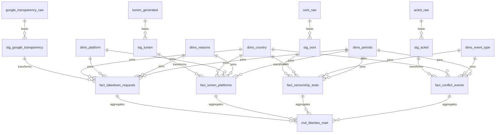
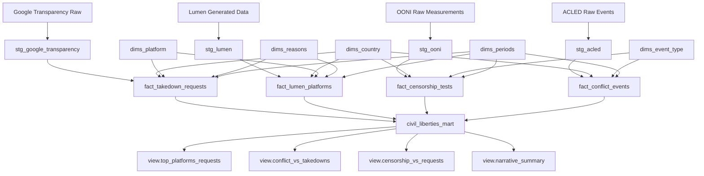

# 📐 **ERD and Dataset Lineage**

## 🗂️ **Entity Relationship Diagram (ERD)**

```mermaid
erDiagram
    google_transparency_raw ||--o{ stg_google_transparency : feeds
    lumen_generated ||--o{ stg_lumen : feeds
    ooni_raw ||--o{ stg_ooni : feeds
    acled_raw ||--o{ stg_acled : feeds

    stg_google_transparency ||--o{ fact_takedown_requests : transforms
    stg_lumen ||--o{ fact_lumen_platforms : transforms
    stg_ooni ||--o{ fact_censorship_tests : transforms
    stg_acled ||--o{ fact_conflict_events : transforms

    dims_country ||--o{ fact_takedown_requests : joins
    dims_country ||--o{ fact_lumen_platforms : joins
    dims_country ||--o{ fact_censorship_tests : joins
    dims_country ||--o{ fact_conflict_events : joins

    dims_platform ||--o{ fact_takedown_requests : joins
    dims_platform ||--o{ fact_lumen_platforms : joins

    dims_event_type ||--o{ fact_conflict_events : joins
    dims_event_type ||--o{ fact_censorship_tests : joins

    dims_reasons ||--o{ fact_takedown_requests : joins
    dims_reasons ||--o{ fact_lumen_platforms : joins

    dims_periods ||--o{ fact_takedown_requests : joins
    dims_periods ||--o{ fact_lumen_platforms : joins
    dims_periods ||--o{ fact_censorship_tests : joins
    dims_periods ||--o{ fact_conflict_events : joins

    fact_takedown_requests ||--o{ civil_liberties_mart : aggregates
    fact_lumen_platforms ||--o{ civil_liberties_mart : aggregates
    fact_censorship_tests ||--o{ civil_liberties_mart : aggregates
    fact_conflict_events ||--o{ civil_liberties_mart : aggregates
```

🔄 Dataset Lineage Diagram

```mermaid
flowchart TD
    A1[Google Transparency Raw] --> B1[stg_google_transparency]
    A2[Lumen Generated Data] --> B2[stg_lumen]
    A3[OONI Raw Measurements] --> B3[stg_ooni]
    A4[ACLED Raw Events] --> B4[stg_acled]

    B1 --> C1[fact_takedown_requests]
    B2 --> C2[fact_lumen_platforms]
    B3 --> C3[fact_censorship_tests]
    B4 --> C4[fact_conflict_events]

    D1[dims_country] --> C1
    D1 --> C2
    D1 --> C3
    D1 --> C4

    D2[dims_platform] --> C1
    D2 --> C2

    D3[dims_event_type] --> C3
    D3 --> C4

    D4[dims_reasons] --> C1
    D4 --> C2

    D5[dims_periods] --> C1
    D5 --> C2
    D5 --> C3
    D5 --> C4

    C1 --> E[civil_liberties_mart]
    C2 --> E
    C3 --> E
    C4 --> E

    E --> F1[view.top_platforms_requests]
    E --> F2[view.conflict_vs_takedowns]
    E --> F3[view.censorship_vs_requests]
    E --> F4[view.narrative_summary]
```
